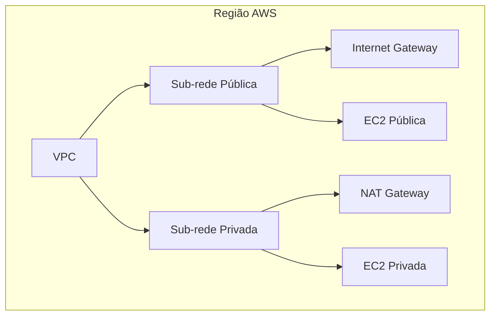
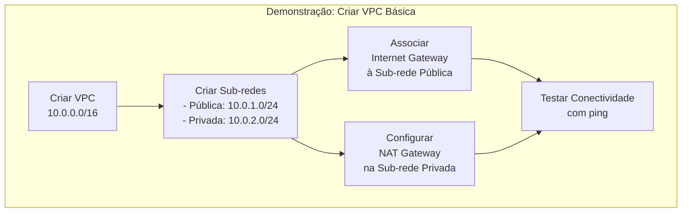

## Amazon VPC (Virtual Private Cloud)

- **Serviço fundamental da AWS** que permite criar redes isoladas na nuvem.
- Integra-se com diversos serviços AWS (EC2, RDS, S3, etc.)

---

## **1. Sub-redes?**
### **O que é uma sub-rede?**
- Intervalo de endereços IP dentro de uma VPC.
- **Zonas de Disponibilidade (AZs):**
- Cada sub-rede fica em **uma AZ** (não pode abranger múltiplas AZs).

### **Tipos de Sub-redes**

| Tipo        | Características                                                                 |     |
| ----------- | ------------------------------------------------------------------------------- | --- |
| **Pública** | - Tráfego roteado para a internet via **Internet Gateway (IGW)**.               |     |
| **Privada** | - Sem rota direta para a internet. Pode acessar a internet via **NAT Gateway**. |     |

### **Regras Importantes**
- Blocos CIDR de sub-redes **não podem se sobrepor** na mesma VPC

---

## **2. Grupos de Segurnaça (Security Groups)**
### **O que é?**

- Firewall **no nível da instância (EC2).**
- **Stateful:** Se o tráfego de saída é permitido, a resposta é automaticamente autorizada.

### **Regras Padrão**

- **Bloqueia todo tráfego** por padrão (é necessário liberar manualmente).
- Permite configurar:
  - Protocolo (TCP, UDP, ICMP).
  - Intervalo de portas.
  - Origem/destino (IPs ou outros grupos de segurança).

---

## **3. ACLs de Rede (Network ACLs)**
### **O que é?**

- Firewall **no nível da sub-rede.**
- **Stateless:** Tráfego de saída precisa ser explicitamente permitido.

### **Tipos**  
| Tipo          | Comportamento                                                                 |  
|---------------|-------------------------------------------------------------------------------|  
| **Padrão**    | Permite todo tráfego.                                                         |  
| **Personalizada** | Nega todo tráfego até adicionar regras.                                   |

### **Regras**

- Numeradas (incrementos de 10 ou 100).
- Avaliadas em ordem numérica.

---

### **4. Componentes de uma VPC Típica**

## **5. Integração com Outros Serviços AWS**

- **Exemplos:** EC2, RDS, S3, Elastic Load Balancing, Lambda.
- **Caso de uso:** Uma instância EC2 em uma VPC pode acessar um banco de dados RDS na mesma VPC.

---

## **6. Perguntas de Verificação**

1. **Qual nível o grupo de segurança protege?**
    
    - ==R: Nível da instância (EC2).==
        
2. **Qual é o maior bloco CIDR que pode ser escolhido?**
    
    - ==R: `/16` (65.536 endereços IP).==

---

## **7. Demonstração Prática**

- **Passos para criar uma VPC básica:**
    
    1. Criar VPC com bloco CIDR (ex.: `10.0.0.0/16`).
        
    2. Adicionar sub-redes (pública e privada).
        
    3. Associar Internet Gateway à sub-rede pública.
        
    4. Configurar NAT Gateway para sub-rede privada.
        
    5. Testar conectividade com `ping`.

